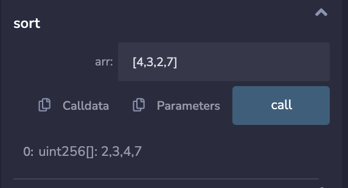

# Array Sorting and Remove Duplicate
This smart contract has the following function in library, which can be reusable.
- Sorting Array : It can sort unisgned integer.
- Remove Duplicte : It can remove duplicate elements from array.

## Example 
- Sorting Example
    - 
- Remove Duplicate Example
    - 

## Author
Sufiyan 