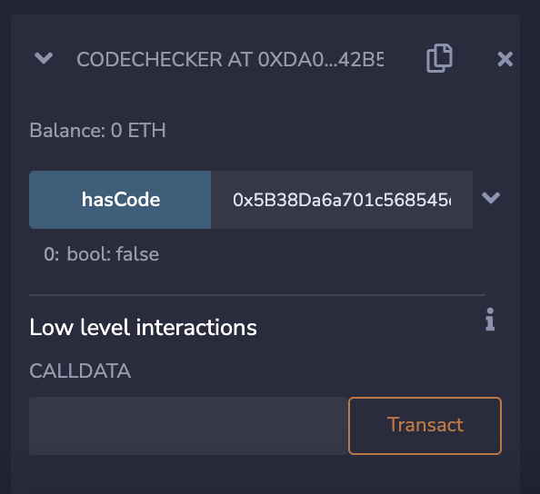
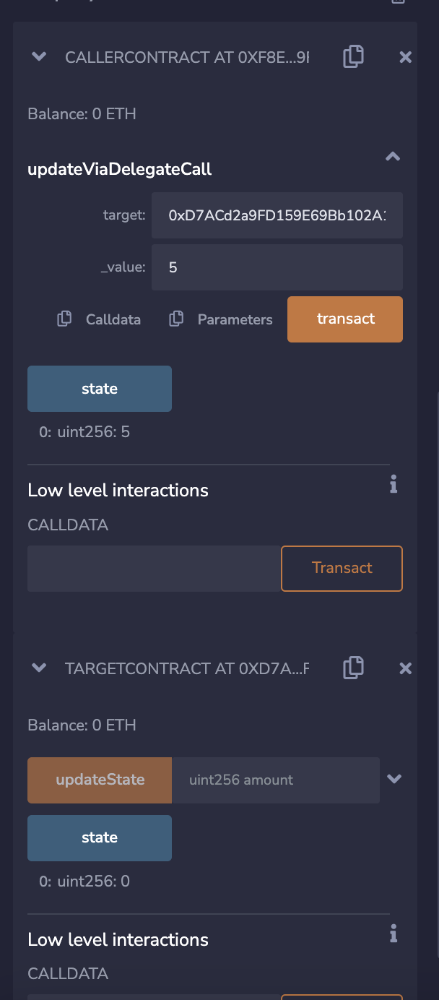

# LAB 2 Code Value, Delegate Call & Advantages and Disadvantages atomic swap and cross-chain briges

## Contracts 
1. Address has code or not
    - It checks that the address has the code or not, i simple terms is the address contract or EOA.

    - ScreenShots
        1. Example checking an EOA( Externally Owned Account) address.
            - 
        2. EXample checking an contract address. 
            - 

2. Delegate Call to another contract
    - Here we are delgating call to an another contract to perfrom some action
        1. TargetContract :
            - it has the state variable of uint state (note name of the state variable does'nt matter only the type and order matters).
            - An function to update that state varibale.
        2. DelegateContract :
            - it has the same state variable type, with any name.
            - An function for delegating calling other contract. 
                - This will perform the logic of target contract but update state of delgate contract.

    - ScreenShots
        -             

## Atomic swap
- Advantages:
    1. Trustless: No need for intermediaries.
    2. Privacy: Transactions are directly between two parties.
    3. Security: Funds are not held by a third party.

- Disadvantages:
    1. Complexity: Implementation can be complicated.
    2. Liquidity: Both parties need to agree on terms, which can result in reduced liquidity.
    3. Speed: Can be slower as it requires multiple steps and waiting for confirmations.    

## Cross chain Bridges
- Advantages:
    1. Liquidity: Bridges often have liquidity pools, easing asset swaps.
    2. Usability: Typically user-friendly and require fewer steps than atomic swaps.
    3. Ecosystem Growth: Allows for assets to be utilized across different blockchains.
- Disadvantages:
    1. Centralization: Some bridges have centralized components or governance.
    2. Security: An issue in the bridge can result in loss of funds.
    3. Cost: Depending on the bridge, fees can be high.

## Author
Sufiyan