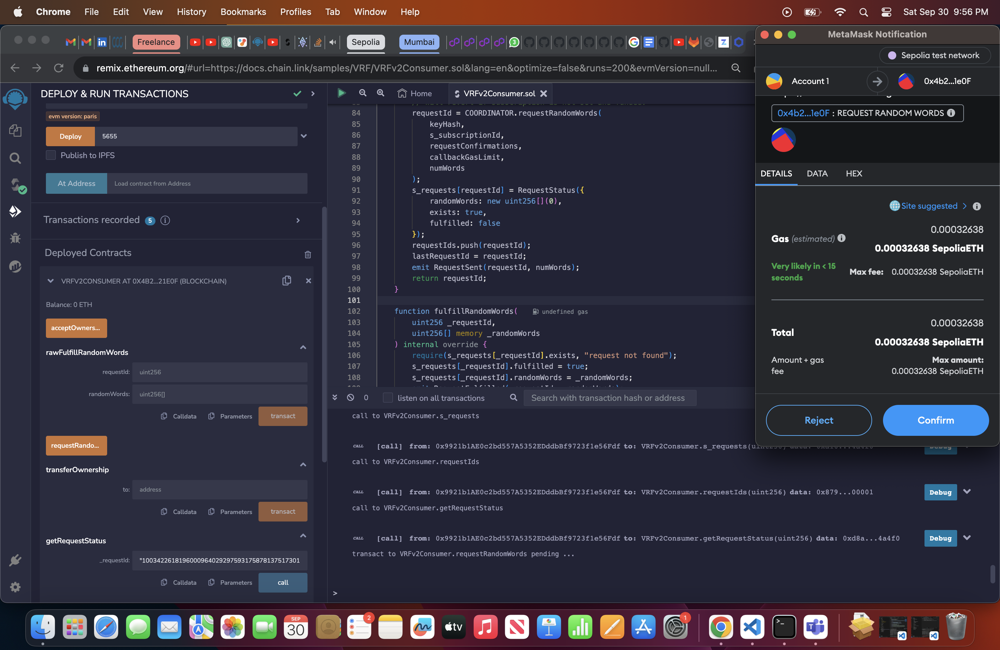
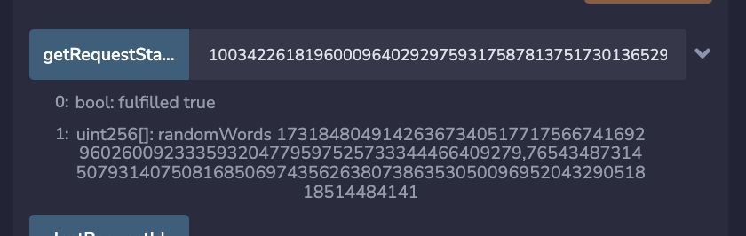

# Chainlink VRF Random Number Generation with Sepolia Testnet

This guide will walk you through the steps to get a random number using the Chainlink VRF on the Sepolia Testnet. The Chainlink VRF (Verifiable Random Function) provides a provably-fair and verifiable source of randomness that's suitable for various applications, including but not limited to, gaming, lottery systems, and more.

## Prerequisites

- Metamask or a similar Ethereum wallet.
- Ropsten ETH for gas (get from a faucet like [this one](https://faucet.ropsten.be/)).
- Chainlink tokens for fees.
- [Remix IDE](https://remix.ethereum.org/) for deploying and interacting with the smart contract.

## Steps

### 1. Setup Remix IDE with Metamask

Connect your Metamask wallet to Remix IDE and ensure you are on the Sepolia Testnet.

### 2. Deploy the VRF Consumer Contract

In the Remix IDE, copy the VRF Consumer contract from the Chainlink documentation (found [here](https://docs.chain.link/vrf/v2/subscription/examples/get-a-random-number)). Compile and deploy it.

### 3. Fund the Contract

Once deployed, send some Ropsten ETH to your contract to fund the gas fees for the random number request transaction and callback.

### 4. Request Random Number

Interact with the deployed contract by calling the `getRandomNumber` function. This will initiate a request to the Chainlink VRF.

### 5. Confirm the Request

Check your contract's `randomResult` variable after a few minutes. It should now be populated with a random number.

## Conclusion

You have successfully integrated Chainlink VRF to get a verifiable random number on the Sepolia Testnet.

Happy coding!
