- Start minikube
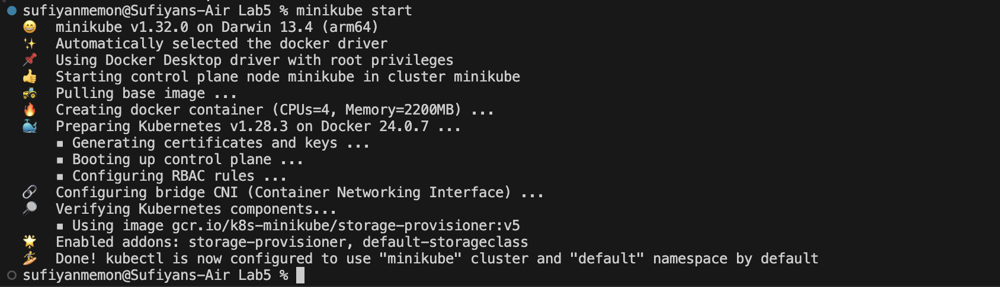
- installing premethes

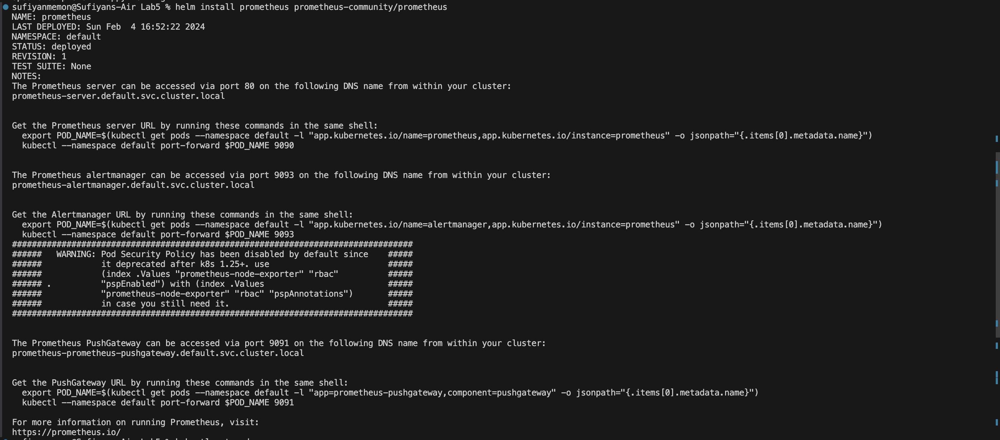
- getting pods

- getting svc
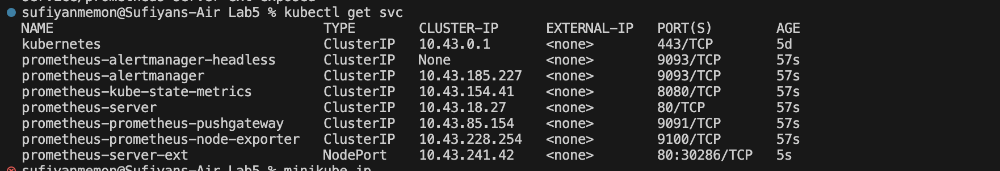
- expose service

- gettign svc again to check
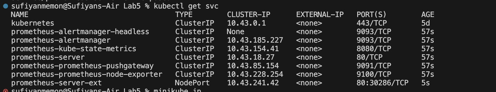
- installing grafana

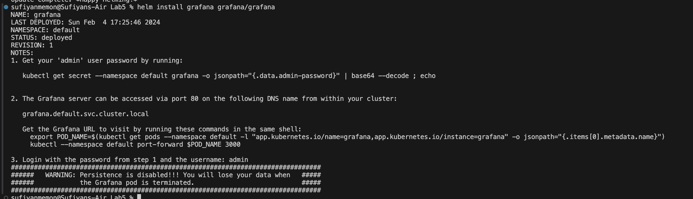
- getting pods

- getting svc
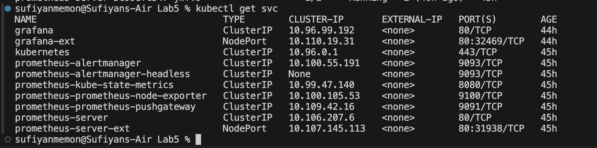
- starting tunneling service for prometheus
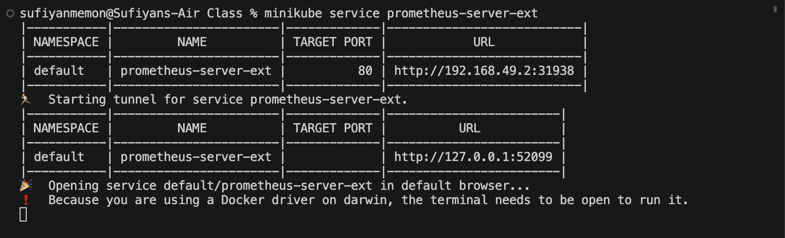
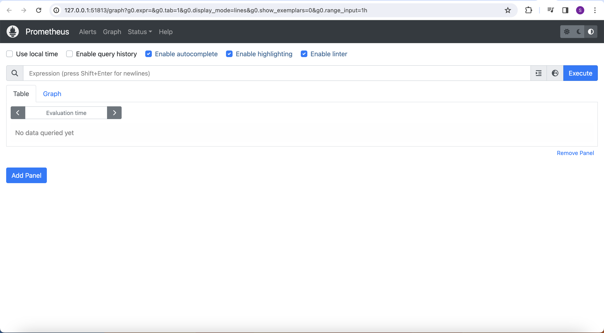
- starting tunneling service for grafana
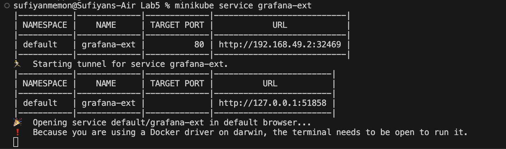
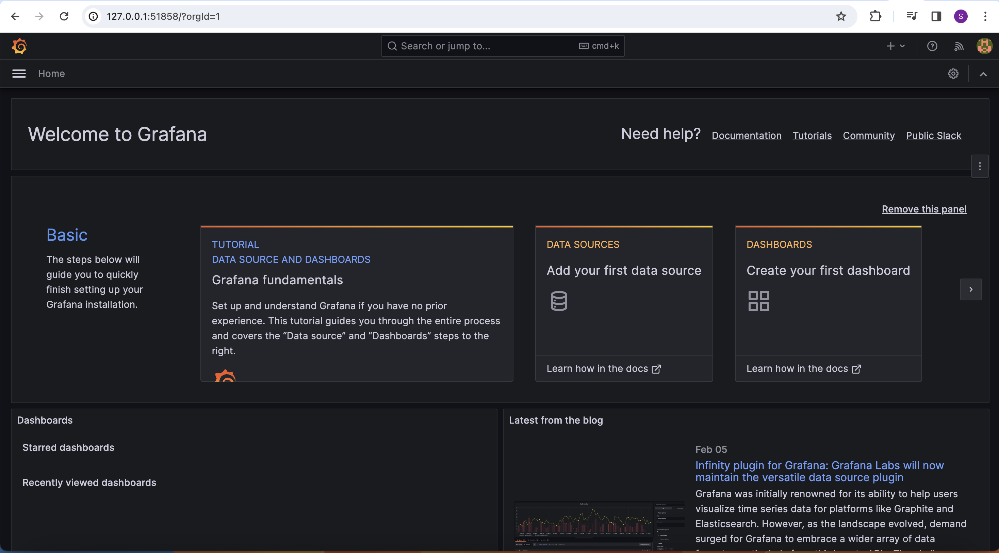
- connecting prometheus to grafana
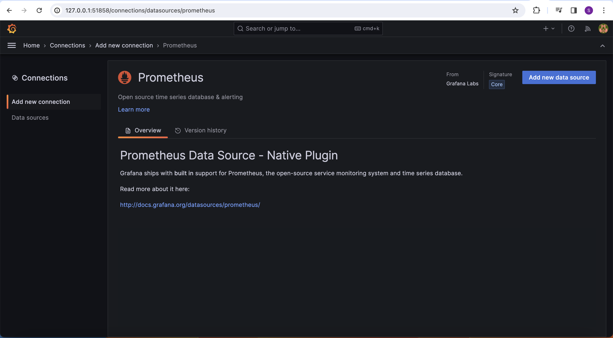
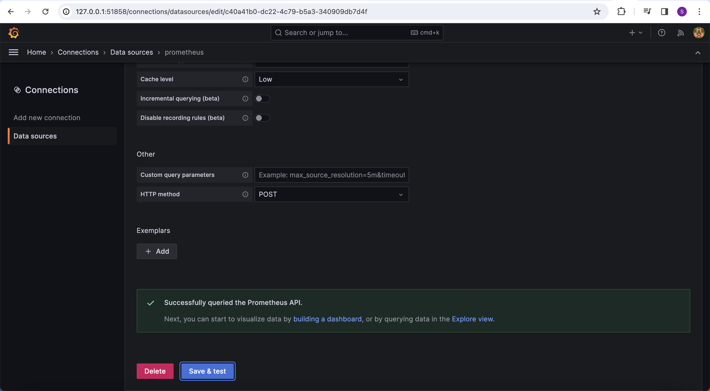
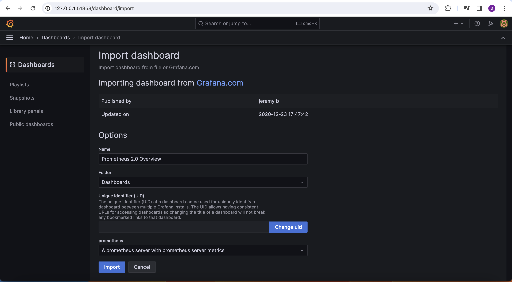
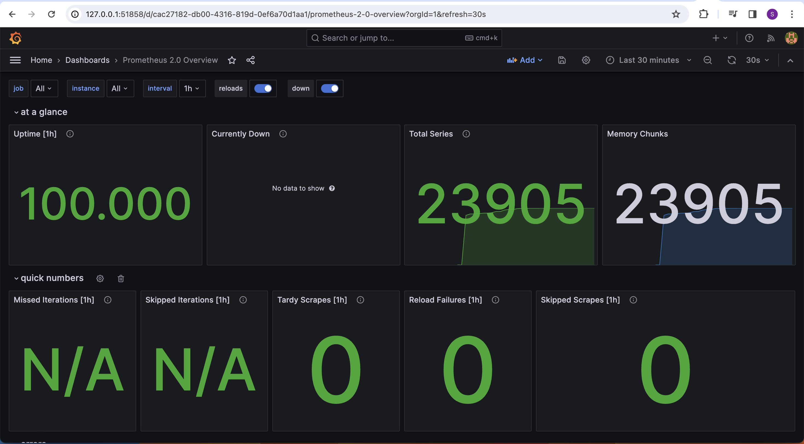