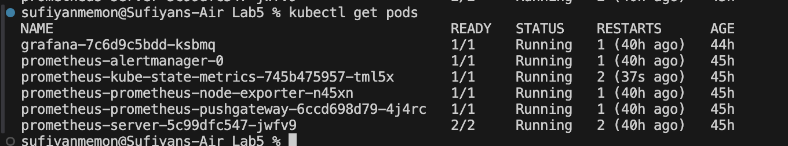

- Start minikube

- installing premethes

- getting pods

- getting svc

- expose service

- gettign svc again to check

- installing grafana

- getting pods

- getting svc

- starting tunneling service for prometheus

- starting tunneling service for grafana

- connecting prometheus to grafana

